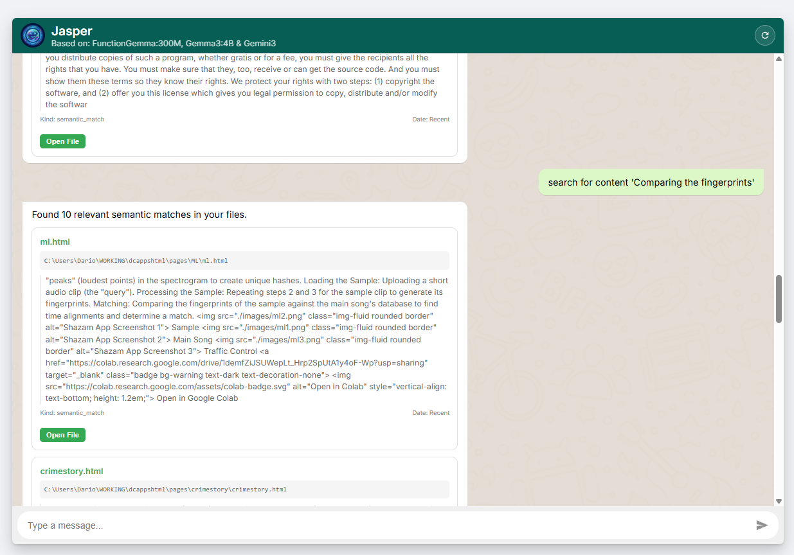
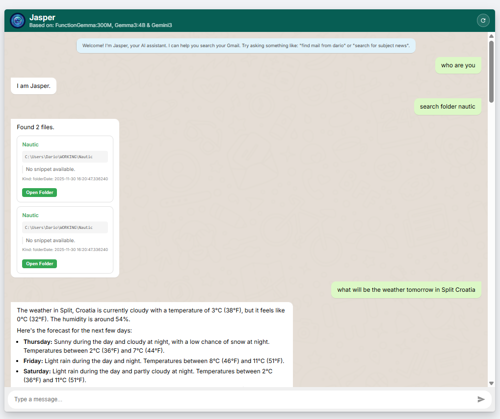
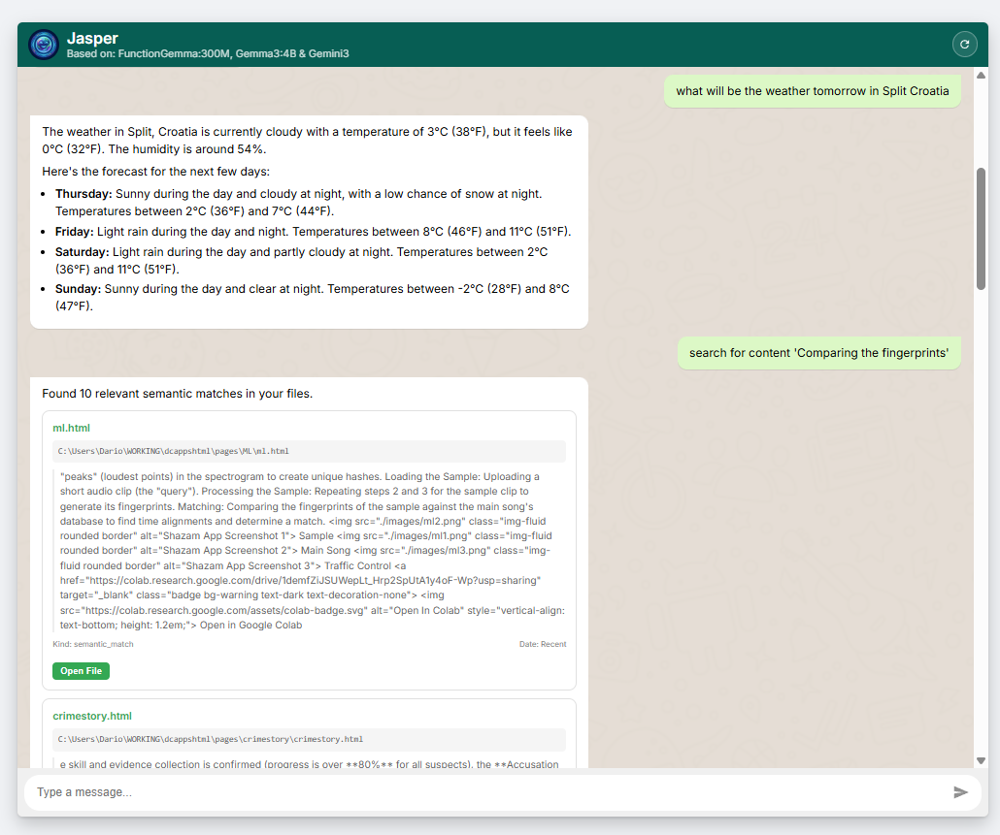
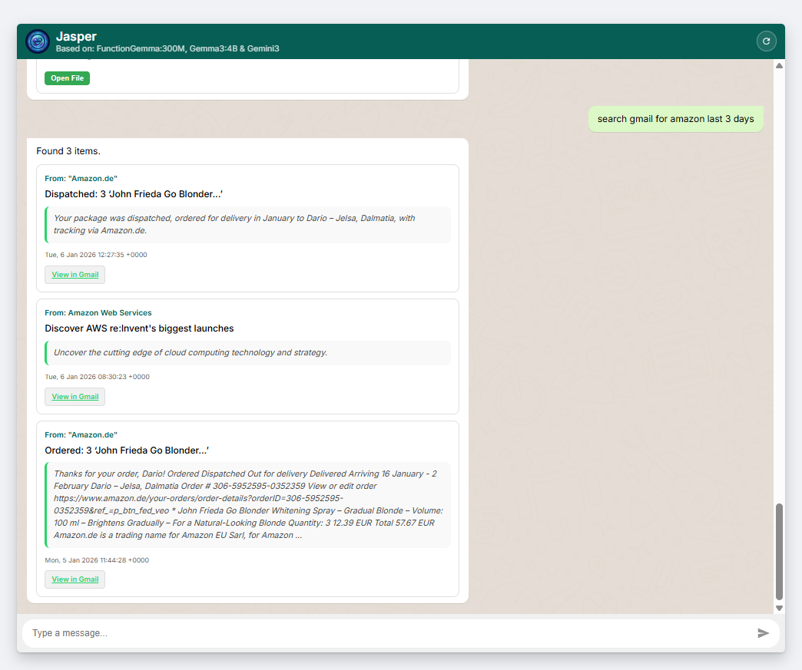

# Jasper - AI Assistant (V1.1 Stable)
> [!NOTE]
> Jasper is currently **Windows-First**. Native support for macOS and Linux is on the roadmap.

Jasper is a high-performance AI agent designed to bridge the gap between your local files, emails, and the web. Built in just three days, it serves as a unified "Knowledge Hub" that consolidates information across silos where standard tools like Outlook, File Explorer, and Gmail often stop.

Unlike native search tools that may fail to index deep file content, Jasper uses a hybrid approach of local AI and vector databases to ensure no document or email is left behind.




## Features
- **Unified Search**: Consolidate searches across Gmail, Outlook, Local Files, and the Web via a standardized plugin interface.
- **AI Architecture**: Powered by a multi-model stack (FunctionGemma, Gemma3, and Gemini) with a "Hybrid Core" philosophy.
- **Semantic Content Search**: Search *inside* files (HTML, JS, CSS, TXT) using AI-powered meaning matching (ChromaDB).
- **Deep File Discovery**: Robust 2-level recursive search fallback for nested project directories.
- **PDF Intelligence**: Integrated `pypdf` text extraction for professional document summarization.
- **Privacy First**: Local files are processed locally; Cloud models are only used for real-time web data.
- **Index Lifecycle**: Formalized CLI for building, refreshing, and pruning your knowledge index.
- **Modern Architecture**: Streamlined Web-first design (legacy CLI components removed for V1.1).
- **Deep Linking**: Open emails or files directly with one click.

For a detailed history of changes, see the [Changelog](./CHANGELOG.md).

## AI Architecture (Hybrid Core)
Jasper follows a "Dual-Track" architectural philosophy:

### 1. The Personal Core (Custom Scripts)
For highly sensitive or performance-critical data (Local Files, Mail), Jasper uses **Lean Custom Scripts**. This ensures maximum speed, local execution, and zero protocol overhead when searching your filesystem or inbox.

### 2. The Multi-Model Engine
1. **FunctionGemma (300MB)**: Our "Intent Controller" running locally to route commands.
2. **Gemma3 4B**: Our "Summarization Specialist" for deep document analysis.
3. **Gemini 2.0**: Our "Web Bridge" for real-time data (Weather, Stocks, News).
4. **ChromaDB**: Our "Semantic Memory" for content-based matching.

## Future Roadmap: External Ecosystem (MCP)
To enable Jasper to grow into a massive ecosystem, we are adopting the **Model Context Protocol (MCP)** for the "Integration Layer."

> [!IMPORTANT]
> **Technical Note**: Jasper is moving toward a **Model-Agnostic tool architecture**. By implementing MCP, we ensure that Jasper's local knowledge remains private while enabling "Plug-and-Play" connectivity with the broader agent ecosystem.

- **Modular Plugins**: Future support for Slack, Jira, GitHub, and Kita will be implemented as **MCP Servers**. This allows Jasper to "plug and play" with any external community tool without bloating the core code.
- **Cloud AI Integration**: MCP will act as the bridge between Jasper's local knowledge and advanced cloud agents.


### The Agentic Future: Beyond Search
Development is progressing in carefully planned, incremental steps. Our ultimate goal is to evolve Jasper from a "Knowledge Hub" into a **Local AI Agent**. 

Future releases will introduce **Agentic Features** where Jasper will have the capability to:
- **Supervise Complex Workflows**: Monitor multiple task statuses across different platforms.
- **Autonomous Decision Making**: Make logical choices based on the context of your data to resolve blockers.
- **Task Orchestration**: Proactively initiate new tasks (e.g., drafted replies, calendar scheduling, or file generation) based on its findings.

## Installation & Setup
For a complete step-by-step setup on a new machine, please see [SETUP.md](./SETUP.md).

Quick start:
1. Clone the repo.
2. Run `python run.py`.
   - *Jasper will automatically create a virtual environment, install dependencies, pull missing models, and build your initial index.*
3. Run `startup/setup_automation.bat` as Administrator to enable recurring indexing.

Jasper prioritizes security by separating secrets from configuration:

### 1. Secrets (.env)
Copy `.env.example` to `.env`. This is where you store:
- `GEMINI_API_KEY` (Get one at [Google AI Studio](https://aistudio.google.com/))
- `GMAIL_PASS` (Google App Password)
- `OUTLOOK_PASS` (If using IMAP mode)

### 2. General Settings (constants.json)
Use `constants.json` for non-sensitive tweaks:
- `"PROVIDER"`: `"GMAIL"` or `"OUTLOOK"`
- `"USER_NAME"`: Your Windows profile name.

---

### Email Provider Setup
- **Gmail**: Enable IMAP in settings and use an **App Password**.
- **Outlook Classic**: Just ensure you are signed in. Jasper will use COM to talk to the local app.
- **New Outlook / Web**: Use the IMAP settings in `.env`.

## Advanced: Index Management
Manage your semantic index via the CLI:
```bash
python -m jasper.utility.indexer status   # View index stats
python -m jasper.utility.indexer refresh  # Incremental update
python -m jasper.utility.indexer prune    # Remove deleted files
python -m jasper.utility.indexer build    # Rebuild from scratch
```

## Platform Roadmap
- [x] **Windows (V1.1 Stable)**: Full support for Local Indexing, Outlook COM, and Startup Tasks.
- [ ] **macOS (Planned)**: Apple Mail connector, Spotlight-based local search.
- [ ] **Linux (Planned)**: IMAP-first mode, Grep-based local fallback.

## Usage
- **Start Jasper**: Run `startup/run_web.ps1`.
- **Open Dashboard**: Go to [http://localhost:8000](http://localhost:8000).
- **Auto-Startup**: Set Jasper to start at login by running this in an Administrator PowerShell window:
  ```powershell
  Set-Location "path\to\Jasper"
  & .\install_as_startup.ps1
  ```
  *(Jasper will automatically use its current location for the startup task)*

## UI Scaling
Jasper uses a **Comfortable 18px Scale** for maximum readability on all screens.


## benefits
1. Unified Intelligence (The "One Brain" Effect)
In a standard setup, your Files, Gmail, and Outlook are three separate silos.

Without Jasper: You search for "Hvar project" in File Explorer, find nothing, then switch to Outlook, search there, then switch to Gmail.
With Jasper: You ask once. Jasper is cross-platform. It can search across your local drive AND your cloud services (Gmail/Outlook) simultaneously. Windows Search natively cannot "reach into" your Gmail inbox.
2. Natural Language Date Filtering
Standard search bars are actually quite bad at dates. Try searching for "Friday before last" in File Explorer; it won't work. Jasper uses the date_utils.py logic we built to turn human phrases into precise SQL timestamps. It makes finding "that file from a few weeks ago" much less of a chore.

3. "Dumb" to "Smart" Fallback
As we saw with the ML folder, the native Windows Search Indexer is a bit of a "black box"—if it decides not to index a folder, you're out of luck. Because we wrote the code, we inserted that Surgical Fallback. Jasper is "smart" enough to say: "The database says it's not there, but I know where the user works, let me go manually check the ML folder just in case."

4. Preparation for the "Action Layer"
This is the most important part for the future. Native search is a Dead End: you find the file, and that's it. Jasper's search is an Entry Point:

Native Search: "Find the invoice." -> You find it.
Jasper: "Find the last invoice from Dario and tell me the total amount." Because the search results are in Python code, we can pipe that file content directly into a summarizer or an action (like drafting a reply email).


5. Semantic Search (The Next Step)
By having this infrastructure, we are 90% of the way to True Semantic Search. Once we add a Vector DB (ChromaDB/FAISS), you'll be able to search for "budget stuff" and it will find a spreadsheet named 2024_projections.xlsx because it understands the meaning of the content, not just the filename.



In short: Outlook and File Explorer are "Search Tools." Jasper is a "Knowledge Hub" that connects the dots between your different worlds.